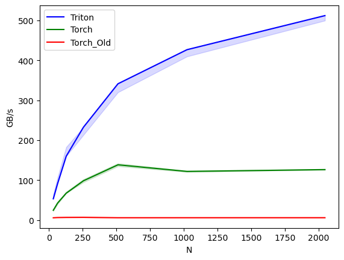

# fast-GeM

Efficient and general implementation of Generalized Mean Pooling (GeM).


<!--  -->

The [original implementation](https://amaarora.github.io/posts/2020-08-30-gempool.html#pytorch-implementation) is quite slower due to the `F.avg_pool` function and multiple kernel executions.

We provide a new PyTorch implementation that is 4\~20 times faster than the original.
This implementation is suitable for environments without OpenAI Triton or when the input is a CPU tensor.

Additionally, we offer a Triton-based implementation.
We achieved 3\~4 times faster than our new PyTorch implementation and 6\~85 times faster than the original by utilizing kernel-fusion.

Our implementation is easy to use, maintaining a similar interface to the original while supporting flexible input data shapes.


## Installation

```sh
pip install fast-gem
```


## Usage

For 2D image tensor (batch, channel, width, height):
```py
import torch
from fast_gem import GeM

# for 4D tensor (batch, channel, height, width) case
gem = GeM().cuda()
x = torch.rand(2, 3, 224, 224, device="cuda")
y = gem(x)
y.shape  # shape: (2, 3, 1, 1)

# for 3D tensor (batch, channel, length) case
gem = GeM(dim=-1).cuda()
x = torch.rand(2, 32, 1024, device="cuda")
y = gem(x)
y.shape  # shape: (2, 32, 1)

# for 4D tensor (batch, channel, depth, height, width) case
gem = GeM(dim=-1).cuda()
x = torch.rand(2, 32, 64, 64, 64, device="cuda")
y = gem(x)
y.shape  # shape: (2, 32, 1, 1, 1)

# or you can make not keep 1s and different initial `p` value instead of 3.0
gem = GeM(p=2.0, dim=-1, keepdim=False).cuda()
x = torch.rand(2, 32, 64, 64, 64, device="cuda")
y = gem(x)
y.shape  # shape: (2, 32)
```
